# OS-EX.3-TROUBLESHOOTING-OF-OS---CASE-STUDY

## AIM:
Troubleshooting of the Operating System.

## PROCEDURE:

### STEP 1-Identify the Problem:
Start by determining the specific issue or error you're encountering. Is it a system crash, slow performance, software not working, or something else?

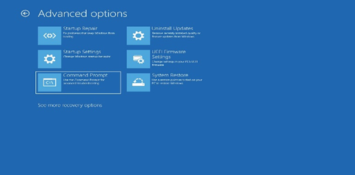

### STEP 2-Gather Information:
Collect relevant information about the problem. Note error messages, system behavior, recent changes, or any patterns related to the issue.

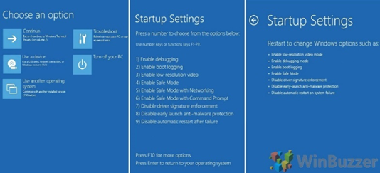

### STEP 3-Check for Updates:
Ensure your operating system, drivers, and software are up to date. Sometimes,updating can resolve compatibility or security issues updating can resolves.

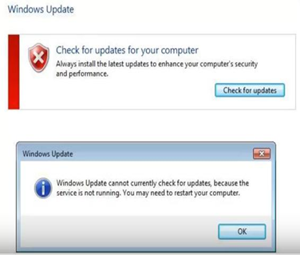

### STEP 4-Restart the System:
A simple restart can often fix minor glitches and improve system performance.

### STEP 5-Check Hardware:
If it's a hardware-related issue, ensure that all hardware components are properly connected and functioning. Look for loose cables, overheating, or hardware failures.

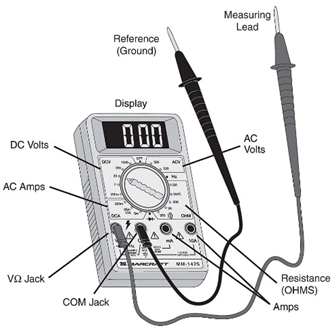

### STEP 6-Run Diagnostic Tools:
Use built-in diagnostic tools provided by the operating system to identify hardware or software problems.

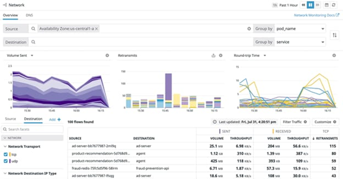

### STEP 7-Review Event Logs:
Check the system logs for error messages or warnings that might provide clues about the issue. In Windows, you can use the Event Viewer; in Linux, check syslog or journalctl.

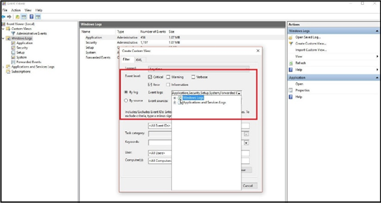

### STEP 8-Remove Recently Installed Software:
If the problem started after installing new software, consider uninstalling it to see if that resolves the issue.

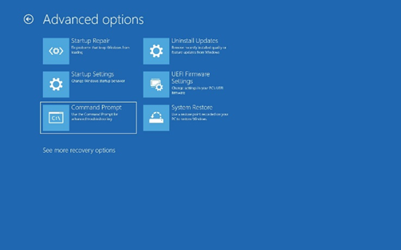

### STEP 9-Safe Mode:
Boot the system into safe mode to check if the problem persists. Safe mode loads the OS with minimal drivers and can help identify if third-party software is causing the issue.

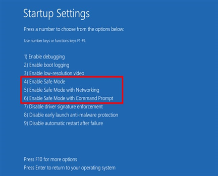

### STEP 10-Virus and Malware Scan:
Perform a full system scan for viruses and malware using reputable antivirus software.

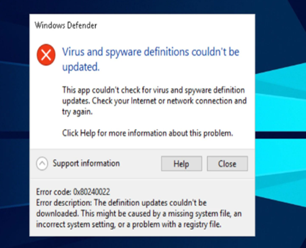

### STEP 11-Check Disk and File System:
Use built-in utilities like chkdsk (Windows) or fsck (Linux) to scan and repair disk errors and file system issues.

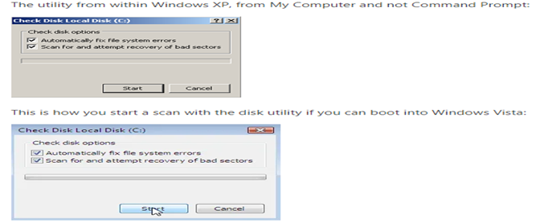

### STEP 12-Update Drivers:
Ensure that your hardware drivers (graphics, sound, network) are up to date. Outdated drivers can cause various problems.

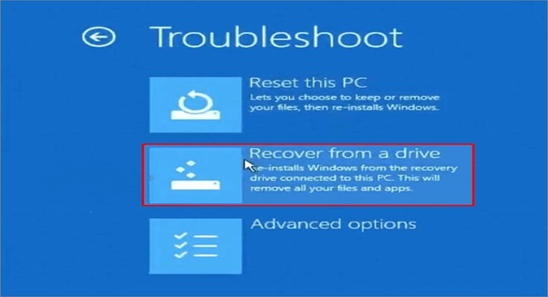

### STEP 13-System Restore:
If applicable, consider using system restore points to revert your system to a previous state when it was working correctly.

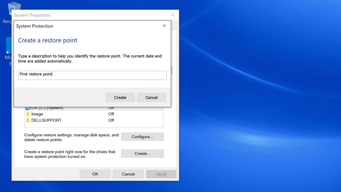

### STEP 14-Backup Data:
If all else fails and you suspect a major issue, back up your important data before attempting any major repairs or reinstallations.

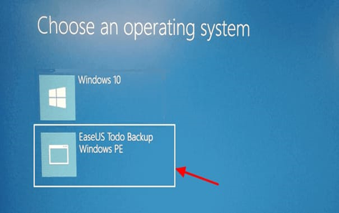

### STEP 15-Reinstall OS:
As a last resort, you may need to reinstall the operating system. Make sure to back up your data first.

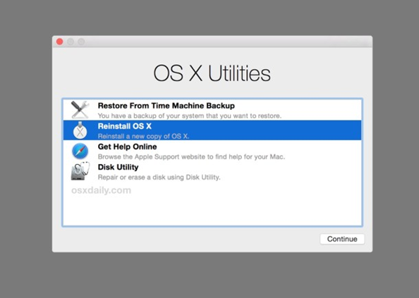

## RESULT:
The Troubleshooting for the Operating System has been successfully done.
